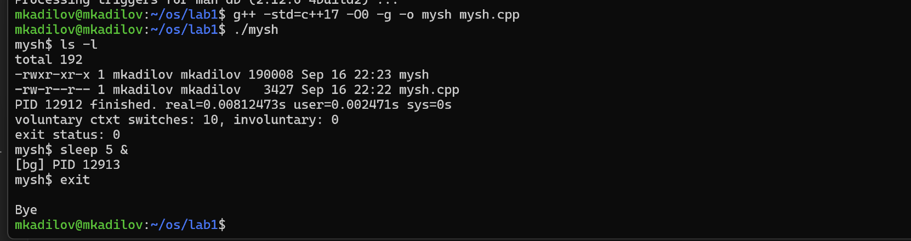

# Операционные системы  
# Лабораторная работа №1


## Задание Часть 1. Запуск программ

Необходимо реализовать собственную оболочку командной строки - shell. Выбор ОС для реализации производится на усмотрение студента. Shell должен предоставлять пользователю возможность запускать программы на компьютере с переданными аргументами командной строки и после завершения программы показывать реальное время ее работы (подсчитать самостоятельно как «время завершения» – «время запуска»).

## Задание Часть 2. Мониторинг и профилирование

Разработать комплекс программ-нагрузчиков по варианту, заданному преподавателем. Каждый нагрузчик должен, как минимум, принимать параметр, который определяет количество повторений для алгоритма, указанного в задании. Программы должны нагружать вычислительную систему, дисковую подсистему или обе подсистемы сразу. Необходимо скомпилировать их без опций оптимизации компилятора.

Перед запуском нагрузчика, попробуйте оценить время работы вашей программы или ее результаты (если по варианту вам досталось измерение чего либо). Постарайтесь обосновать свои предположения. Предположение можно сделать, основываясь на свой опыт, знания ОС и характеристики используемого аппаратного обеспечения.

1. Запустите программу-нагрузчик и зафиксируйте метрики ее работы с помощью инструментов для профилирования. Сравните полученные результаты с ожидаемыми. Постарайтесь найти объяснение наблюдаемому.
2. Определите количество нагрузчиков, которое эффективно нагружает все ядра процессора на вашей системе. Как распределяются времена  USER%, SYS%, WAIT%, а также реальное время выполнения нагрузчика, какое количество переключений контекста (вынужденных и невынужденных) происходит при этом?
3. Увеличьте количество нагрузчиков вдвое, втрое, вчетверо. Как изменились времена, указанные на предыдущем шаге? Как ведет себя ваша система?
4. Объедините программы-нагрузчики в одну, реализованную при помощи потоков выполнения, чтобы один нагрузчик эффективно нагружал все ядра вашей системы. Как изменились времена для того же объема вычислений? Запустите одну, две, три таких программы.
5. Добавьте опции агрессивной оптимизации для компилятора. Как изменились времена? На сколько сократилось реальное время исполнения программы нагрузчика?

### Ограничения

Программа (комплекс программ) должна быть реализован на языке C, C++.  
Дочерние процессы должны быть созданы через заданные системные вызовы выбранной операционной системы, с обеспечением корректного запуска и и завершения процессов.  Запрещено использовать высокоуровневые абстракции над системными вызовами. Необходимо использовать, в случае Unix, процедуры libc.

### Требования к отчету и защите

- Отчет должен содержать титульный лист с указанием номера и названия ЛР, вашего ФИО, ФИО преподавателя практики, номера вашей группы, варианта ЛР.
- Отчет должен содержать текст задания в соответствии с вариантом.
- Отчет должен содержать листинг исходного кода всех программ, написанных в рамках данной ЛР.
- Отчет должен содержать предположения о свойствах программ-нагрузчиков
- Отчет должен содержать результаты измерений и метрик программ-нагрузчиков, полученных инструментами мониторинга. Должно быть описано, какие утилиты запускались, с какими параметрами и выводом.
- Отчет должен содержать сравнительный анализ ожидаемых и фактических значений.
- Отчет должен содержать вывод.
- Студент должен быть готов продемонстрировать работоспособность Shell и предоставить исходный код.
- Студент должен быть готов воспроизвести ход работы в рамках части 2 и продемонстрировать схожие результаты работы программ-нагрузчиков.

### Темы для подготовки к защите лабораторной работы:

1. Структура процесса и потоков;
2. Системные утилиты сбора статистики ядра;
3. Основы ввода-вывода (блочный и последовательный ввод-вывод);
4. Файловая система procfs;
5. Использование утилиты strace, ltrace, bpftrace;
6. (*) Профилирование и построение flamegraph'а и stap;


### Мой вариант
```
Кадилов Михаил Владимирович stress-ng ( --icache 15 --far-branch-flush --timeout 2h, --flushcache 15 --far-branch-flush --timeout 2h, --cache 10 --cache-enable-all --timeout 2h,--branch 10 --far-branch-flush --timeout 2h)
```

# Часть 1

### Компиляция и запуск

```
g++ -std=c++17 -O0 -g -o mysh mysh.cpp 
./mysh
```




 # Часть 2

 ### Компиляция и запуск


### 1. stress_ng_by_iterations.cpp
🔧 Компиляция

Без оптимизаций (как требуют в ЛР):
```
g++ -std=c++17 -O0 -pthread stress_ng_by_iterations.cpp -o stress_ng_by_iterations
```

С оптимизациями (для сравнения):
```
g++ -std=c++17 -O3 -march=native -pthread stress_ng_by_iterations.cpp -o stress_ng_by_iterations_opt
```

### Примеры запуска

Формат:
```bash
./stress_ng_by_iterations <iterations_icache> <iterations_cache> <cache_size> <iterations_branch> <threads>
```

1) Базовый запуск, без оптимизаций:
(Прогоняем 100k итераций icache, 10k проходов по кэшу, размер кэша 4096, 100k ветвлений, 4 потока)
```bash
./stress_ng_by_iterations 100000 10000 4096 100000 4
```

2) С оптимизациями (-O3):
```bash
./stress_ng_by_iterations_opt 100000 10000 4096 100000 4
```

3) Увеличение нагрузки для полного использования всех ядер (например, 8):
```bash
./stress_ng_by_iterations 500000 50000 16384 500000 8
```

### 2. stress_ng_by_seconds.cpp
🔧 Компиляция

Без оптимизаций:
```
g++ -std=c++17 -O0 -pthread stress_ng_by_seconds.cpp -o stress_ng_by_seconds
```

С оптимизациями:
```
g++ -std=c++17 -O3 -march=native -pthread stress_ng_by_seconds.cpp -o stress_ng_by_seconds_opt
```

### Примеры запуска

Формат:
```
./stress_ng_by_seconds --mode <icache|flushcache|cache|branch> --iterations <N> [--timeout <sec>]
```

1) Прогрев icache, 1M итераций, без таймаута:
```
./stress_ng_by_seconds --mode icache --iterations 1000000
```

2) Flushcache, 500 итераций, таймаут 10 секунд:
```
./stress_ng_by_seconds --mode flushcache --iterations 500 --timeout 10
```

3) Cache нагрузка, 10k итераций, с оптимизациями (-O3):
```
./stress_ng_by_seconds_opt --mode cache --iterations 10000
```

4) Branch нагрузка, 50M итераций:
```
./stress_ng_by_seconds --mode branch --iterations 50000000
```
